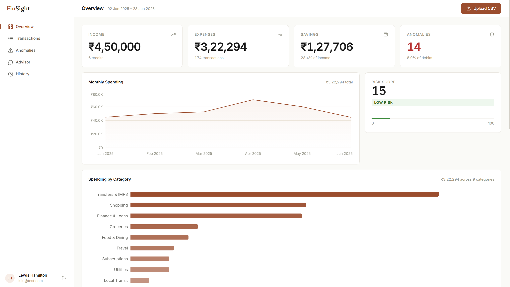
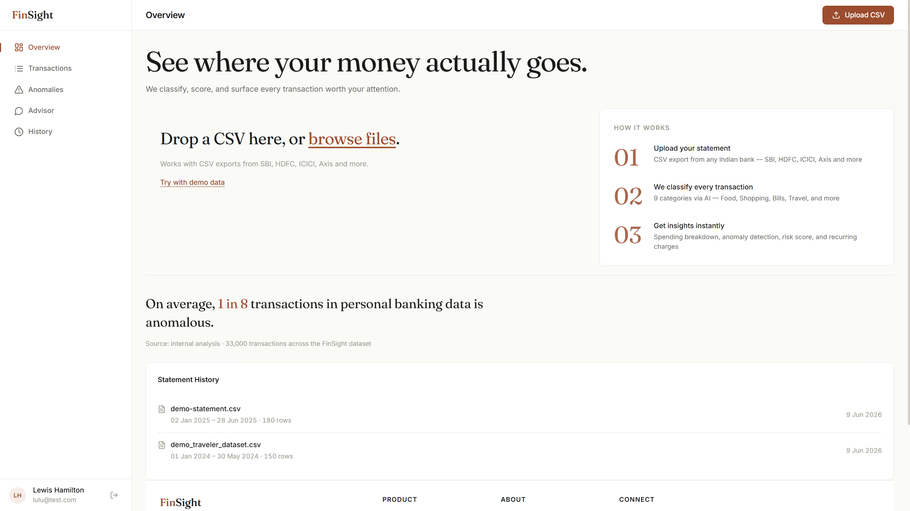
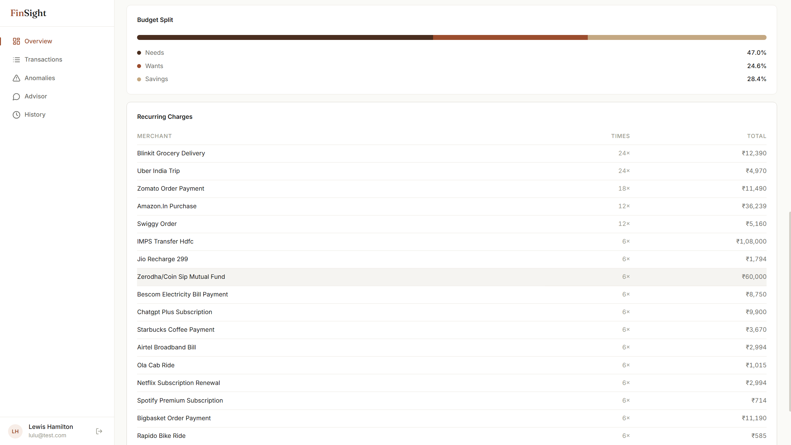
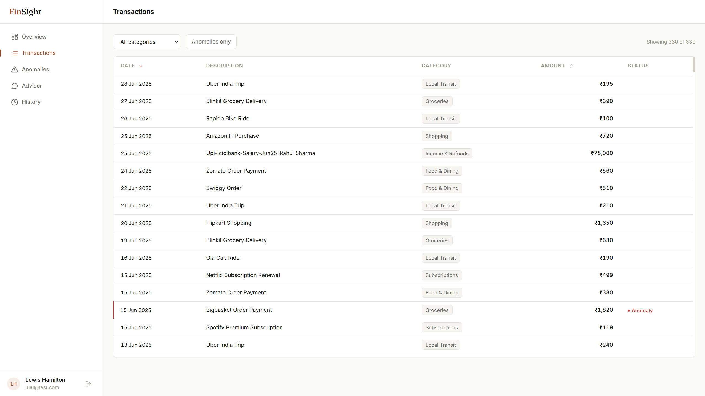
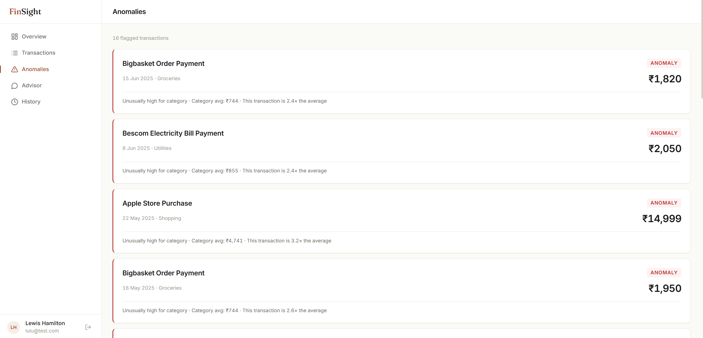
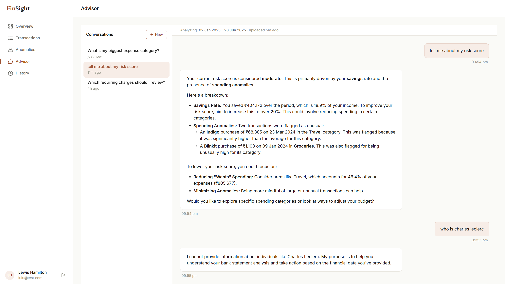

# FinSight

**AI-powered personal finance analytics — semantic transaction classification, robust anomaly detection, risk scoring, and a conversational advisor grounded in your real data.**




---

## Overview

FinSight ingests bank statement CSVs and produces a categorized, anomaly-flagged, risk-scored view of personal finances. Built around a hybrid transaction classifier, a robust statistical anomaly engine, and a conversational AI advisor that explains insights in plain language. Processes 33,000+ transactions in under 20 seconds.

Built as an extension of research presented at **FMS National Conference 2026 (Best Paper Award)** on AI adoption in FinTech.

---

## Features

**Hybrid Transaction Classification.** Deterministic merchant overrides for high-frequency Indian merchants (Zomato, Blinkit, Myntra, etc.) combined with sentence-transformer embeddings (`all-MiniLM-L6-v2`) for the long tail. Production-grade pattern: rules for confidence, ML for generalization.

**Robust Anomaly Detection.** MAD-based modified Z-score with kurtosis-adaptive thresholding. Unlike classical Z-score, the median and MAD are not pulled toward extreme values, so outliers don't mask themselves.

**Risk Scoring.** Weighted blend of savings rate, expense ratio, and anomaly density — calibrated against realistic financial thresholds (healthy users score near 0; Critical Risk requires genuine distress across all components).

**Conversational AI Advisor.** Powered by Gemini 2.5 Flash-Lite with context injection — the user's pre-computed analysis (KPIs, category breakdown, anomalies, recurring charges) is injected into the system prompt. The LLM answers questions grounded in real transaction-level data, never hallucinated numbers.

**Persistent Multi-User Storage.** JWT authentication, SQLAlchemy ORM over PostgreSQL, conversation history threaded per user.

---

## Screenshots

### Landing & Onboarding


### Overview Dashboard


### Transactions


### Anomalies


### AI Advisor


---

## ML Methodology

### Transaction Classification

Each transaction description is first checked against a dictionary of high-confidence merchant overrides (Zomato, Amazon, Netflix, etc. → known category). Unknown merchants fall through to a sentence-transformer encoder (`all-MiniLM-L6-v2`), which produces a 384-dimensional embedding compared against pre-computed embeddings of category descriptors via cosine similarity. This hybrid pattern — rules for known cases, ML for generalization — is standard in production fintech and outperforms either approach alone.

### Anomaly Detection

Uses MAD-based modified Z-score rather than classical Z-score. The reasoning: mean and standard deviation are non-robust statistics — a single extreme value pulls the mean toward itself and inflates the standard deviation, which can mask the very outliers the test is meant to detect. Median and MAD are unaffected by extremes. The 0.6745 scaling constant makes modified Z-score comparable to a standard Z-score under normal distributions.

Thresholds adapt per category based on kurtosis: heavy-tailed categories (Travel, Shopping) use higher cutoffs (~3.0) to avoid flagging naturally variable spending, while low-variance categories (Bills, Subscriptions) use tighter cutoffs (~2.5).

### Recurring Merchant Detection

Fuzzy token-sort matching via `rapidfuzz` with an 85% similarity threshold and 2+ occurrence minimum. Description normalization (lowercasing, stripping payment-rail prefixes like `UPI:xxxx:`) ensures variants merge into single recurring entries.

### AI Advisor

Conversational interface using Gemini 2.5 Flash-Lite (free tier). The user's most recent analysis is rendered as a structured text summary and injected into the system prompt for every conversation. The LLM reasons over real numbers — savings rate, category breakdown, top anomalies, recurring charges — and is explicitly instructed never to invent data. Conversation history is persisted per user in PostgreSQL.

Architectural choice: **context injection over RAG.** For aggregate questions ("why is my risk score X?", "where am I overspending?"), the user's analysis summary is sufficient. RAG over individual transactions adds complexity for a use case that doesn't need it.

---

## Tech Stack

| Layer | Technologies |
|-------|--------------|
| Frontend | React (Vite), Recharts, Lucide Icons, Framer Motion |
| Backend | FastAPI, SQLAlchemy, JWT auth |
| Data | PostgreSQL 16 |
| ML | sentence-transformers, scikit-learn, rapidfuzz, pandas, NumPy |
| LLM | Google Gemini 2.5 Flash-Lite |
| Infrastructure | Docker, Docker Compose |

---

## Local Setup

Requires Docker Desktop and a Google AI Studio API key (free, no credit card needed at [aistudio.google.com](https://aistudio.google.com)).

```bash
# Clone the repo
git clone https://github.com/SebMessi1075/finsight.git
cd finsight

# Add your Gemini API key
echo "GEMINI_API_KEY=your_key_here" > .env

# Spin everything up
docker compose up --build

# Frontend: http://localhost:5173
# API docs: http://localhost:8000/docs
```

Register a new user via the signup screen, then click **"Try with demo data"** on the empty Overview to load a realistic Indian personal finance dataset and explore the full product.

---

## Project Status

Currently runs locally via Docker Compose. Public deployment is paused — the sentence-transformer model requires ~500MB RAM, which exceeds typical free-tier hosting (512MB ceiling). The codebase is structured to support a TF-IDF classifier as a deployment fallback for memory-constrained environments.

---

## Roadmap

- **Income-normalized anomaly baselines** — compute per-category spending as % of monthly income rather than absolute rupees, to handle wealth-disparity bias in anomaly detection
- **Split "Bills & Utilities" into "Utilities" and "Subscriptions"** — already done; tracked for backward-compat data migration
- **Background job queue** (Celery + Redis) for async ML processing on large uploads
- **Email/digest alerts** for anomalies and budget thresholds
- **Bank statement PDF parsing** (currently CSV only)
- **Behavioral pattern detection** in the AI advisor — flagging repeated high-value purchases that individually look "normal" but cumulatively are anomalous

---

## Acknowledgments

Built as an extension of research presented at **FMS National Conference 2026 (Best Paper Award)** — *"Fuzzy-TISM and MICMAC analysis of structural barriers in AI-driven FinTech adoption."*

---

## License

MIT — see [LICENSE](LICENSE) for details.